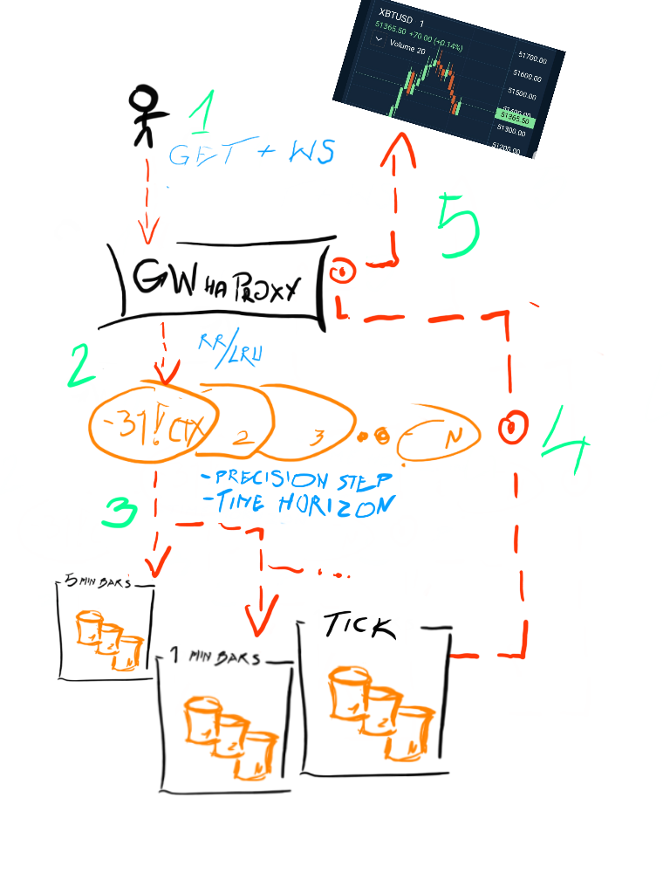

# Scalable Data Fabric Architecture

UI chard data provider and caching service is always a compromise between acuracy and performance.  
By the nature of the use case, stored and presented can be optimized for most use cases:  
 - varioius tick data snapshots can be taken at different time intervals,  
   this can include ie.: `ohlc`, `mavg`, `ema`, `vwap` calculations for those data sets
 - if precision requested is significant, returned data can be further interpolated from snapshots 
 - many copies can be deployed (to speed up read-times)  
 - caches with most frequently or recent data  
  
Gateway and load-balancer system in then necessary to support such a data fabric.  
Belowe brief architecture outline.  




# Workflow

1. User issues a request to see price data for symbols, one day, and expects to receive 1k data points in return ie.:
   ```get[`SYM_A`SYM_B; 2023.01.01; 2023.01.02; 1000] ```
2. HAProxy redirects request to least recently/frequently used (LRU) async gateway
3. Gateway decides on time range and precision where to route query for data samples.  
   It's a step function to route to most accurate snapshot source. So least amount of data is scanned.   
   ```
      D:24*60*60 //seconds in a day
      min30:30*60 //30 mins requested in seconds
      stepRouter: (`s# (`s#-2 0 0.2 0.6 1)!`::dailyOHLC`::min30Snaps`::m5Snaps`::m1snaps`::tick) 

      //which data source to query for start - end within ~ 30min ?
      H: stepRouter (D-min30)%D  // ... `::m1snaps
      
      //if requested big portion of a day ?
      H: stepRouter (D-20*min30)%D  // ... `::m5snaps
   ```

   If it's recent data, different stepRouter definition can be used, pointing to various in mem caches.  
4. Data payload can be now interpolated for required precision. Or different stepRouter can be defined for precision buckets.  
5. Data routed/serialized back to the user   

   
      
